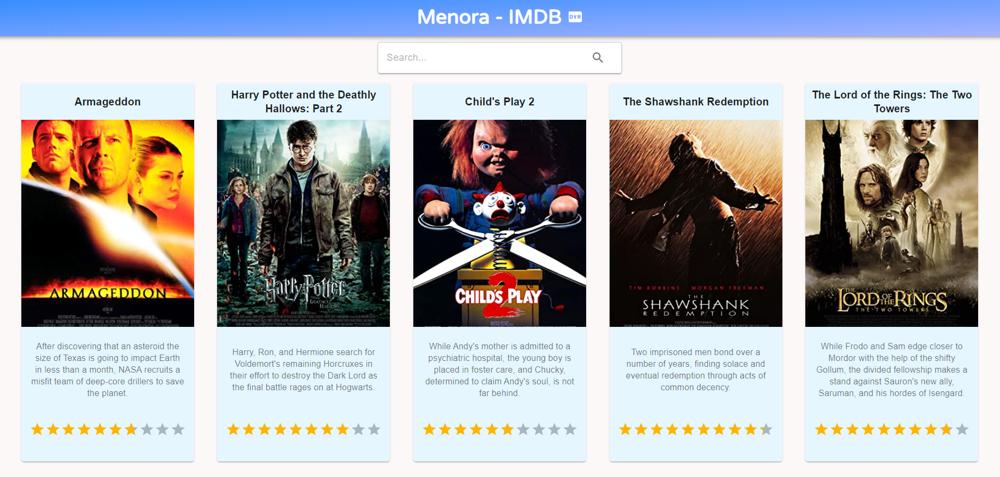
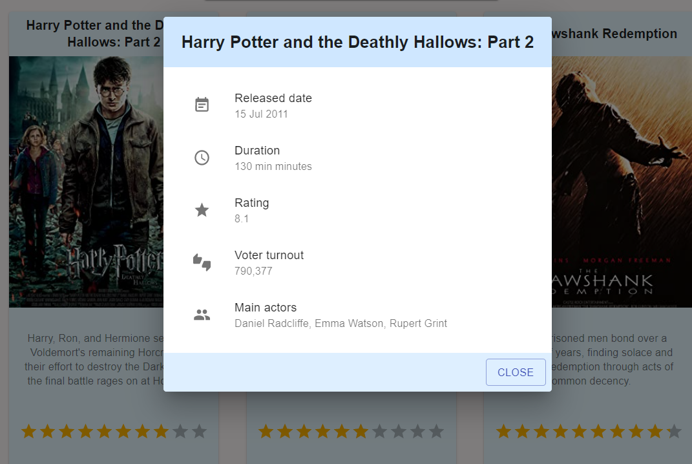
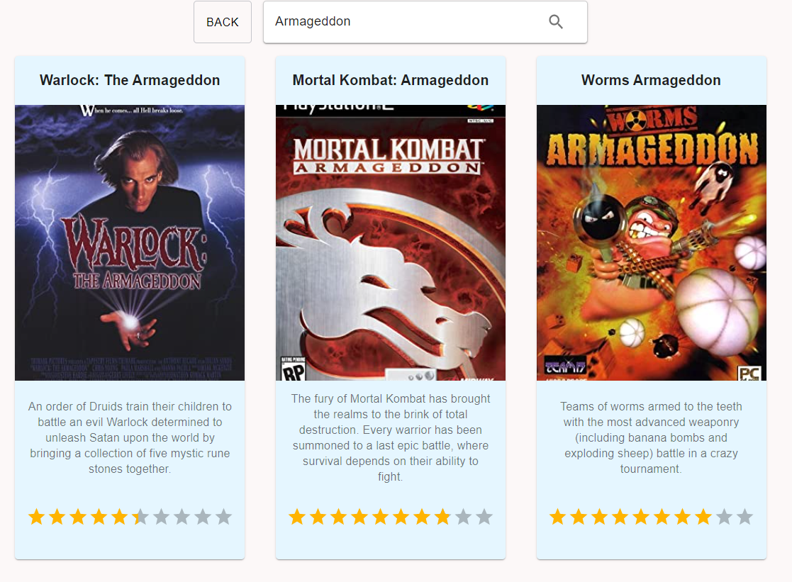

# Assignment - Node.js & React

## Implement a front and server side to get data from http://www.omdbapi.com/

### Installation:
1. download the source code zip or clone via link.
2. open Git Bash or any other terminal in root folder of the project.
3. type: npm install (wait...)
4. type npm run build (wait...)
5. type npm start
6. the server will start running, open the browser and navigate to http://localhost:3001

* you may change the server port in .env files (both in server and client folder)

### Screenshots:

 
 

 
 

